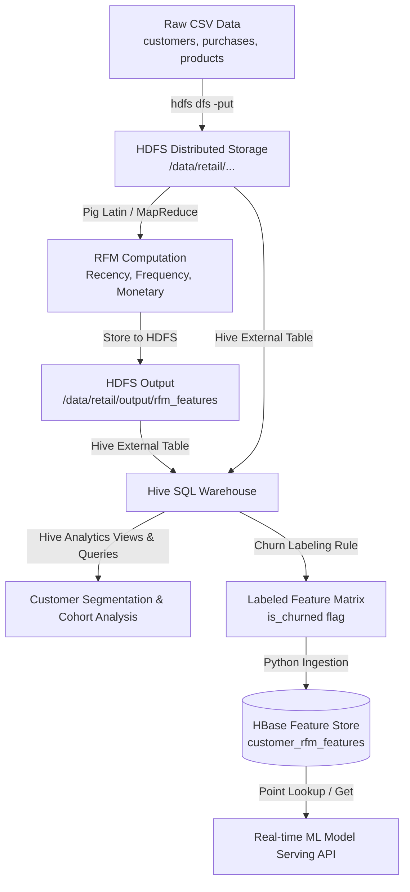

# Problem 18: Retail Customer Segmentation & Churn Prediction (Batch)

## Overview
This repository contains the complete big data batch analytics pipeline built using the **Hadoop Ecosystem (HDFS, MapReduce, Pig, Hive, HBase)** for **Problem 18: Retail Customer Segmentation & Churn Prediction**.

The pipeline ingests customer profiles, product catalog metadata, and transaction purchase history, computes **Recency, Frequency, and Monetary (RFM)** metrics, segments customers into actionable behavioral tiers, performs cohort retention analysis, labels churned customers (`is_churned`), and persists high-performance feature vectors into **HBase** for real-time model serving.

---

## Directory Structure
```text
Assignment1/
├── Problem_18.docx               # Original Assignment Description Document
├── README.md                     # Pipeline Overview & Instructions
├── data/
│   ├── generate_datasets.py      # Synthetic dataset generator script
│   ├── customers.csv             # Customer profile & demographic dataset
│   ├── purchases.csv             # Multi-period transaction purchase history
│   └── products.csv              # Product catalog metadata
└── scripts/
    ├── 01_hdfs_setup.sh          # HDFS directory creation & dataset upload
    ├── 02_rfm_computation.pig    # Pig Latin script to calculate RFM metrics
    ├── 02_rfm_mapper.py          # Hadoop Streaming Mapper alternative
    ├── 02_rfm_reducer.py         # Hadoop Streaming Reducer alternative
    ├── 03_hive_analysis.hql      # Hive DDL/DML for segmentation & cohorts
    ├── 04_hbase_setup.hb         # HBase schema creation script
    ├── 04_hbase_load.py          # Script generating HBase put statements
    ├── 04_hbase_queries.sh       # HBase shell point lookup & scan examples
    └── run_all_pipeline.sh       # End-to-end master execution workflow
```

---

## Architecture & Data Flow



---

## Step-by-Step Execution Guide

### 1. Prerequisites
- **Java:** OpenJDK 8 or 11
- **Hadoop Ecosystem:** Hadoop 3.x, Pig, Hive, HBase
- **Python:** Python 3.x (with standard library)

### 2. Generate Datasets
```bash
cd data
python generate_datasets.py
```

### 3. Step-by-Step Shell Execution
```bash
cd ../scripts

# Step 1: HDFS Setup
bash 01_hdfs_setup.sh

# Step 2: Pig RFM Computation
pig -x mapreduce 02_rfm_computation.pig

# Step 3: Hive Analysis & Segmentation
hive -f 03_hive_analysis.hql

# Step 4: HBase Schema Setup & Ingestion
hbase shell 04_hbase_setup.hb
python 04_hbase_load.py
hbase shell load_hbase.hb

# Step 5: Verify HBase Feature Vectors
bash 04_hbase_queries.sh
```

### 4. Or Run Full Automated Pipeline
```bash
bash run_all_pipeline.sh
```

---

## Submission Guidelines

Per the assignment rules:
1. **Document (`GROUP_Number.pdf`):** Final comprehensive report including problem statement, architecture, implementation code snippets, and execution screenshots.
2. **Code Bundle (`GROUP_Number_Code.zip`):** Zip file containing `data/` scripts and `scripts/` folder.
3. Submit on **Taxila** platform before **6th August 2026**.
